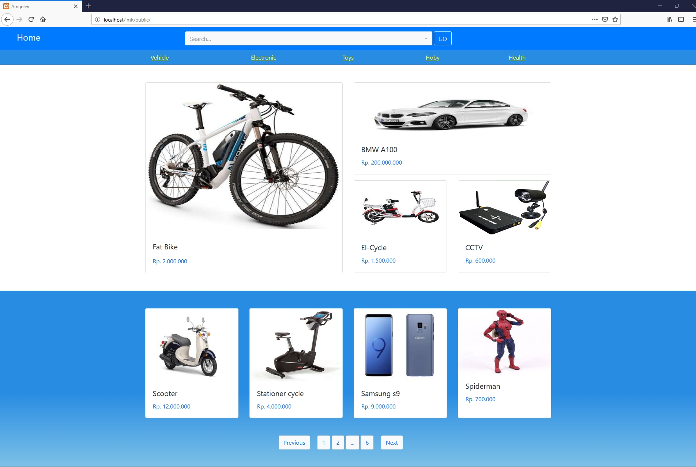
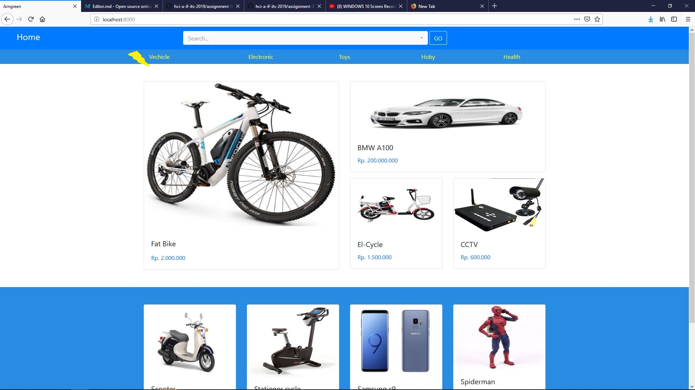
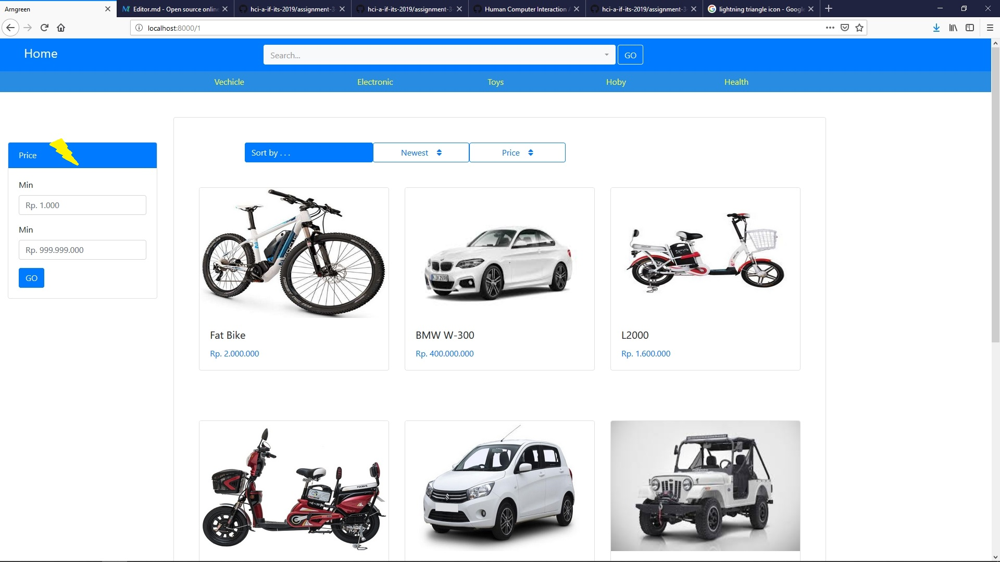
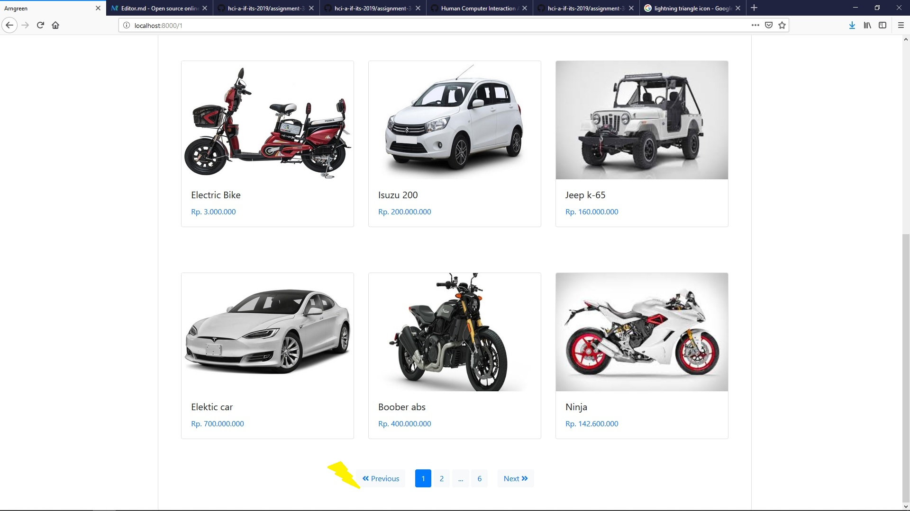
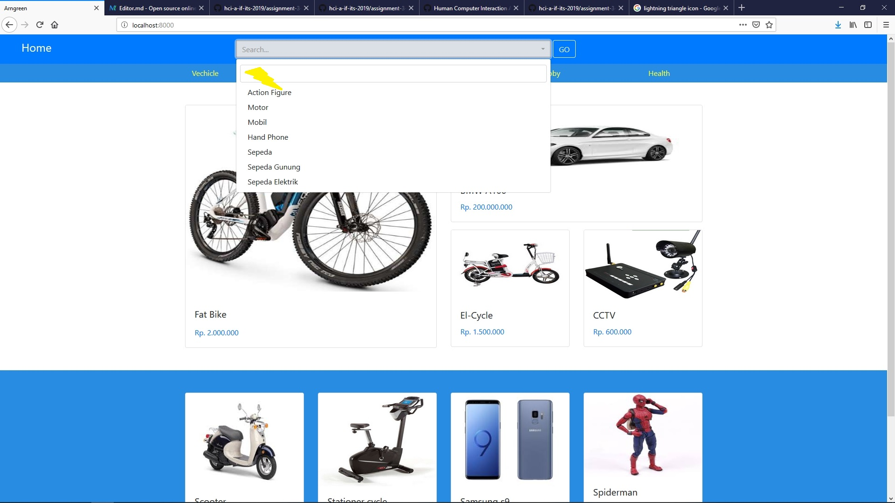
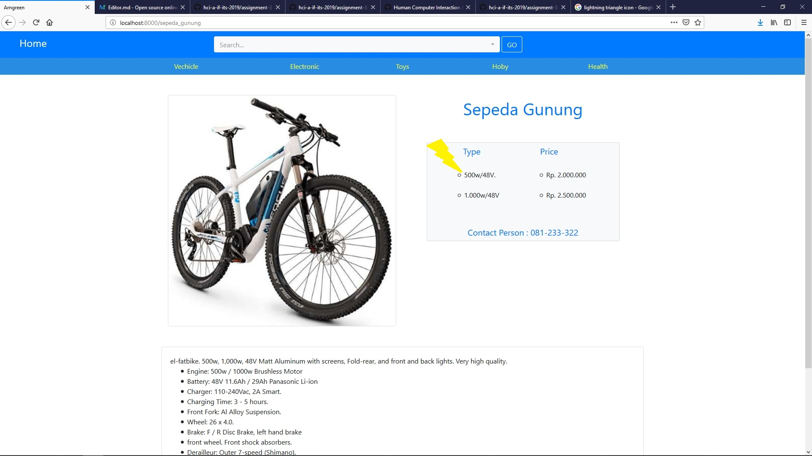
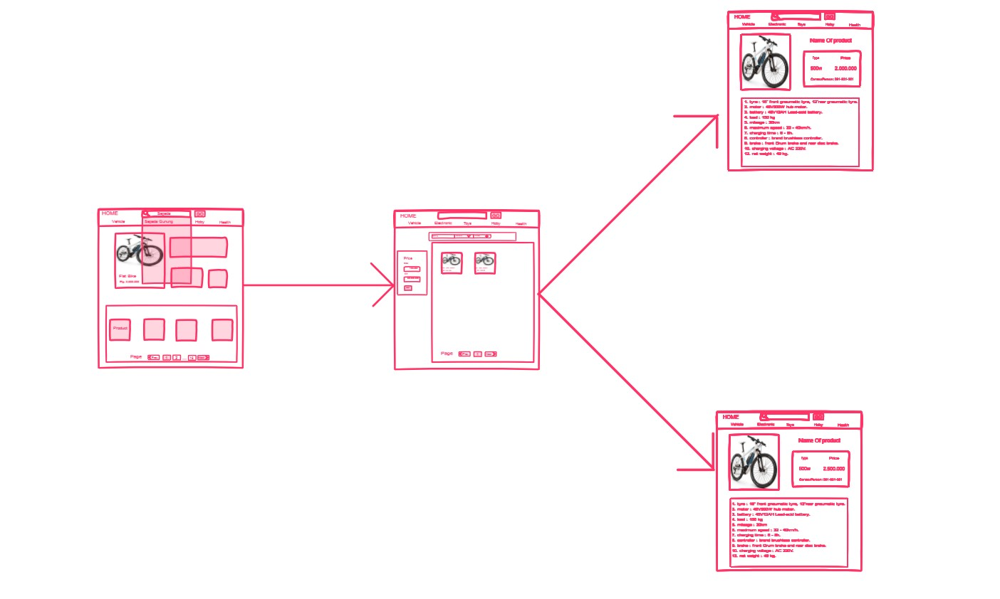

# Usability Evaluation and Prototyping (again)
## Operating the Prototype

Link for Ideal prototype flow https://youtu.be/imx5yM-1Jaw
## Part A: Usability Evaluation
### 1. Brief Description of Participants
#### a. Description of Participant 1
- Female
- 19 Years Old
- High School Student
- Already Familiar with e-commerce website before
- Active internet user
- Active computer and smartphone (Android) user

#### b. Description of Participant 2
- Male
- 28 Years Old
- Online Enterpreneur
- Already Familiar with e-commerce website before
- Active internet user
- Active computer and smartphone (Android) user

### 2. Evaluation Script
### Question
- What is your current occupation?
- How frequently You use the internet?
- How frequently You use computer?
- Have you ever done some online transaction before?
- Have you used Search Suggestion before?

### Intruction
- Show category button
- Change The page
- show Filter price
- Back to home page
- Search "Sepeda gunung"
- Show product Details
- Show the price
- show contact Person

### 3. Transcript

#### a. Transcript with Participant 1

- **00:01** Me : Mba Sebelumnya terimakasih sudah meluangkan waktunya
- **00:08** Me : Mba untuk sehari hari kesibukan nya apa
- **00:12** Her : saya masih sekolah sekarang kelas 3 SMA
- **00:19** Me : Seberapa sering mbaa menggunakan internet
- **00:25** Her : hampir tiap jam mas
- **00:27** Me: Pernah transaksi online ngga via website e-commerce
- **00:29** Her : pernah mas Beli barang online 
- **00:35** Me : sering kah mba menggunakan komputer?
- **00:47** Her : ngga sering" banget sih mas kalo lagi ngerjain tugas atau mau nonton film . kalau browsing lebih sering di Hp , tapi paling ngga waktu weekend buka laptop mas biasanya
- **01:02** Me : Menurut mba Membantu kah fitur search suggestion yang biasa mas gunakan
- **01:13** Her : Membantu Banget sih mas biar ngga usah nyuri satu"
- **01:40** Me : Jadi gini mba saya mau meminta pendapat mba soal web site jual beli saya (Explain that there will be an instruction that user must try to achieve and remind him that it will be used to test the system and not him)
- **03:22** Her : oke.
- **03:23** Me : mba tolong buka kategori vechicle
- **03:26** Her : (click Vechicle Category on navbar) , terus mas
- **03:35** Me : Sekarang tunjukin Fitur Filter Harga mba
- **03:38** Him : (fastly arrange the pointer on the Filter card) , ini kan mas
- **03:46** Me : coba ganti page nya mba
- **03:49** Her : (Automatically scrolling down) ini mas
- **03:58** Me : sekarang kembali ke home mba
- **04:05** Him : (Searching for the home button take a while) udah mas
- **04:19** Me : sip mas sekarang coba search sepeda gunung
- **04:34** Him : (click on search bar and type "sepeda") gini kan mas (clicking on suggestion)
- **04:59** Me : iya mba sip , coba sekarang buka detail produknya mba
- **05:02** Him : (clicking on the product) 
- **05:08** Me : sekarang coba tunjukin harganya mba
- **05:14** Him : (arrange pointer to price details) ini mas  
- **05:20** Her : Tapi ini apa ya mas kok ada 2 harganya
- **05:24** Him : Jadi barang nya dibagi jadi 2 tipe mba yang atas 500w harganya 2jt yang harga 2.5jt buat yang 600w
- **05:29** Her : oalah gitu
- **05:40** Me : Coba tunjukin kontak yang bisa di hubungi mba
- **05:44** Him : (arrange pointer to contact person) yang ini kan dibawah harga
- **05:50** Me : Udah selesai mas itu aja makasih ya mas
- **05:55** Him : iya mas sama sama
		

#### b. Transcript with Participant 2

- **00:01** Me : Mas Sebelumnya terimakasih sudah meluangkan waktunya
- **00:06** Me : Mas untuk sehari hari bekerja sebagai apa
- **00:10** Him : saya Jualan online di salah satu web jual beli
- **00:19** Me : Jadi Aktif dalam menggunakan internet ya untuk keseharian nya
- **00:28** Him : Iya tentu saja.
- **00:35** Me : Untuk Transaksi nya menggunakan laptop atau android biasanya
- **00:47** Him : pake laptop mas biasanya
- **00:59** Me : Menurut mas Membantu kah fitur search suggestion yang biasa mas gunakan
- **01:13** Him : Membantu Banget sih mas soalnya , capek kalau harus nyari 1 1 , terus untuk suggetion nya mempermudah kita misal ada salah ketik
- **01:56** Me : Jadi gini mas saya mau meminta pendapat mas soal web site jual beli saya (Explain that there will be an instruction that user must try to achieve and remind him that it will be used to test the system and not him)
- **03:11** Him : oke.
- **03:12** Me : Mas tolong buka kategori vechicle
- **03:13** Him : (fastly click Vechicle Category on navbar) , terus mas
- **03:18** Me : Sekarang tunjukin Fitur Filter Harga mas
- **03:23** Him : (fastly arrange the pointer on the Filter card) , ini kan mas
- **03:30** Me : sekarang kembali ke home mas
- **03:31** Him : (Clicking on Home Button on top left) udah mas
- **03:33** Me : sip mas sekarang coba search sepeda gunung
- **03:34** Him : (click on search bar and type "sepeda") wah langsung kluar suggestion nya ya mas (clicking on suggestion)
- **03:50** Me : iya mas soalnya baru sedikit isinya , coba sekarang buka detail produknya mas
- **03:51** Him : (clicking on the product) 
- **03:53** Me : sekarang coba tunjukin harganya mas
- **03:55** Him : (arrange pointer to price details) ini mas  
- **04:10** Him : kalau contact person yang mana mas
- **04:11** Him : (arrange pointer to contact person) yang ini kan bawah nya
- **04:14** Me : Udah selesai mas itu aja makasih ya mas
- **04:17** Him : iya mas sama sama
		
### 4. Feedback and Incidence Analysis
> Record your observations per prototype screen followed by reference, feedback, incidence, reason, and resolution.

#### OBSERVATION 1

- **Reference**: Participant 1 **03.26** Participant 2 **03.13**
- **Feedback**: Positive feedback
- **Incidence**: -
- **Reason**: -
- **Resolution**: -

#### OBSERVATION 2

- **Reference**: Participant 1 **03.35** Participant 2 **03.18**
- **Feedback**: Positive feedback
- **Incidence**: -
- **Reason**: -
- **Resolution**: -
 
#### OBSERVATION 3

- **Reference**: Participant 1 **03.49**
- **Feedback**: Positive feedback
- **Incidence**: -
- **Reason**: -
- **Resolution**: -

#### OBSERVATION 4

- **Reference**: Participant 1 **03.26** Participant 2 **03.13**
- **Feedback**: Positive feedback
- **Incidence**: The result didnt show
- **Reason**: The keyword didnt match
- **Resolution**: -

#### OBSERVATION 5

- **Reference**: Participant 1 **03.26** Participant 2 **03.13**
- **Feedback**: negative feedback , The user so confused because of there are two different type on one product 
- **Incidence**: -
- **Reason**: -
- **Resolution**: Make new Product details on each type

## Part B: Prototyping (again)
### Sketch

### Design Rationale
What is most visible from the user saying in CI is what we design must have clear goals, Users can easily find a feature without any confusion and help users in carrying out their activities
### High-Fidelity Interactive-Prototype
https://invis.io/Q8RSX6GD7S4#/360992524_Image_16